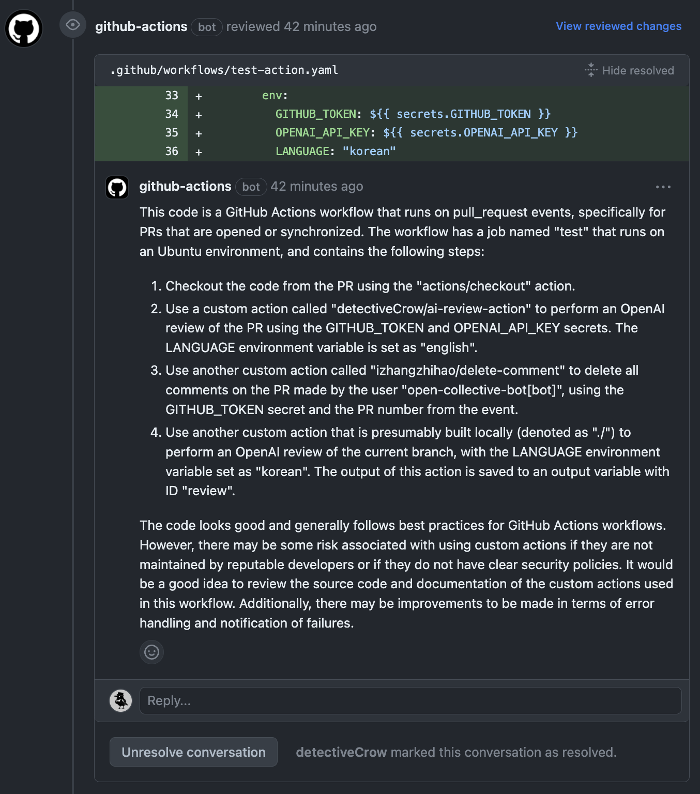

# OpenAI PR Code Review Action

OpenAI generate code review when Pull Request opened.



# How to use

When you use Personal Access Token, please check permission.

```

name: OpenAI PR Review
uses: detectiveCrow/ai-review-action@latest
with:
  GITHUB_TOKEN: ${{ secrets.GH_PAT }}
  OPENAI_API_KEY: ${{ secrets.OPENAI_API_KEY }}
  LANGUAGE: "english"

```

If you use GITHUB_TOKEN, please check jobs permission when leave comment action failed.

```

name: OpenAI Code Review

on:
  pull_request:
    types: [opened, synchronize]

jobs:
  review:
    permissions: write-all # Check permission when leave comment action failed
    runs-on: ubuntu-latest
    steps:
      - name: Checkout
        uses: actions/checkout@v3
      - name: OpenAI PR Review
        uses: detectiveCrow/ai-review-action@latest
        env:
          GITHUB_TOKEN: ${{ secrets.GITHUB_TOKEN }}
          OPENAI_API_KEY: ${{ secrets.OPENAI_API_KEY }}
          LANGUAGE: "korean"
          MODEL: "gpt-3.5-turbo"

```

# Inputs

| Inputs         | Description                               | Required | Default            |
|----------------|-------------------------------------------|----------|--------------------|
| OPENAI_API_KEY | OpenAI Key for API call                   | true     | <None>             |
| GITHUB_TOKEN   | Token for checkout code and leave comment | true     | <None>             |
| LANGUAGE       | Language for comments                     | false    | English            |
| MODEL          | Model for chat completion                 | false    | gpt-3.5-turbo-0301 |

# Outputs

Does not provide any outputs.

